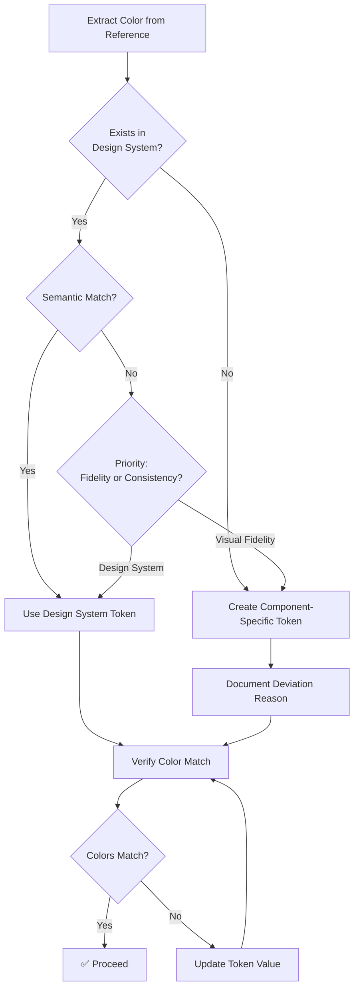

# Component Replacement Prompt

**Purpose:** Replace an existing component's UI with a new design while preserving all functionality, achieving exact visual matches, and ensuring the design system components library always reflects the latest version.

---

## When to Use This Approach

Use this prompt when:
- You have an existing component that works but needs a visual redesign
- The new mockup has a different structure than the existing component
- You want to achieve an exact visual match without structural compromises
- You want clean, modern code following current best practices
- The component is relatively self-contained with clear functionality

**Alternative:** If the structure is similar and you want incremental changes, use the adaptation workflow instead.

---

## Component Scope Identification

**For the LLM:** When analyzing the existing component and mockup, identify component boundaries and handle mixed scenarios:

### Identifying Component Boundaries

**A component should be replaced if it is:**
- Self-contained (has its own state/behavior)
- Reusable (used in multiple places or could be reused)
- Has a clear API (props/attributes, events, methods)

**Not a component if it is:**
- Page-specific layout/glue code
- One-off implementation tied to a single page
- Tightly coupled to page context

### Handling Mixed Scenarios

**Scenario 1: Design System Component + Custom Elements**
- **If custom elements are reusable:** Extract as a new composite component
- **If custom elements are page-specific:** Replace only the design system component, keep custom code separate
- **Guidance:** Ask user to clarify scope - "I see custom header/footer elements. Should these be part of the component or remain separate?"

**Scenario 2: Multiple Components Combined**
- **If they form a reusable pattern:** Create a wrapper/composite component
- **If they're independent:** Replace each component separately
- **Guidance:** "I see this combines `wy-modal` and `wy-chip-list`. Should I create a composite component or replace them separately?"

**Scenario 3: Unclear Boundaries**
- Analyze the mockup structure
- Identify what's reusable vs. page-specific
- **Provide user guidance:** "Based on the mockup, I recommend [extracting X as component / keeping Y as page code] because [reason]. Does this match your intent?"

### Decision Process

1. **Analyze mockup structure** - Identify distinct functional units
2. **Check existing code** - See what's already componentized
3. **Assess reusability** - Would this be used elsewhere?
4. **Clarify with user** - If unclear, ask: "Should [element] be part of the component or remain separate?"

**In the prompt, user should specify:**
- The component(s) being replaced
- Any custom elements that will remain separate
- Whether creating a new composite component
- Any scope questions or uncertainties

---

## Copy This Prompt ⬇️

```markdown
# Component Replacement Request

I need to replace the UI of an existing component with a new design while preserving all functionality.

## Existing Component

**Component Name:** [e.g., `wy-links-modal` or `linksModal`]

**Location:** You must identify the location of this component to facilitate replacement and proper linking. 


## Reference Materials

**New Design Mockup:**
- **Screenshot:** [Attach or describe]
- **Code:** [Path to mockup HTML/CSS or paste code]
- **Design System:** m3-design-v2

**Context:**
- [Where this will be used]
- [Any specific requirements or constraints]

---

## Replacement Workflow

Follow this systematic process to ensure functionality preservation and exact visual match:

### Phase 0: Functionality Specification (CRITICAL)

**Purpose:** Document all functionality before touching UI to ensure nothing is lost.

**IMPORTANT - Component Scope:** Before analyzing, identify component boundaries:
- If mockup combines design system components with custom elements, clarify scope with user
- If multiple components are combined, determine if creating composite or replacing separately
- If boundaries are unclear, analyze structure and provide guidance to user
- Document what's included in the component vs. what remains separate

#### 0.1 Component API Audit

Analyze the existing component and document:

**Props/Attributes:**
- List all props, their types, defaults, and purposes
- Document any required vs. optional props
- Note any prop validation rules

**Events:**
- List all custom events dispatched
- Document event payload structure
- Note when events are fired

**Methods/Public API:**
- List all public methods
- Document method signatures and return values
- Note any side effects

**State Management:**
- Document internal state
- Note state transitions
- Document any state persistence

**Example Output:**
```markdown
## Component API: wy-links-modal

### Props
- `open` (Boolean, default: false) - Controls modal visibility
- `title` (String, default: "AI Tools") - Modal title text
- `links` (Array, required) - Array of link objects with structure:
  ```javascript
  {
    category: String,  // e.g., "Models", "Images"
    name: String,      // Display name
    url: String,       // Link URL
    icon: String?      // Optional icon name
  }
  ```

### Events
- `close` - Dispatched when modal closes (no payload)
- `link-click` - Dispatched when link chip clicked:
  ```javascript
  {
    detail: {
      category: String,
      name: String,
      url: String
    }
  }
  ```

### Methods
- `show()` - Opens the modal (sets `open` to true)
- `close()` - Closes the modal (sets `open` to false, dispatches `close` event)

### State
- `open` (Boolean) - Internal visibility state
- No other internal state
```

#### 0.2 User Interaction Audit

Document all user interactions and their behaviors:

**Click Interactions:**
- What happens when each clickable element is clicked
- Any conditional behavior based on state
- Any side effects (navigation, state changes, etc.)

**Keyboard Interactions:**
- Keyboard shortcuts supported
- Tab navigation behavior
- Focus management
- ESC key handling

**Hover/Focus States:**
- Visual feedback provided
- Any state changes on hover/focus
- Accessibility considerations

**Form Interactions (if applicable):**
- Form submission behavior
- Validation rules
- Error handling
- Success states

**Example Output:**
```markdown
## User Interactions: wy-links-modal

### Click Interactions
- **Overlay click**: Closes modal (dispatches `close` event)
- **Close button click**: Closes modal (dispatches `close` event)
- **Link chip click**: 
  - Dispatches `link-click` event with link data
  - Navigates to link URL (if not prevented)
  - Closes modal (optional, depends on implementation)

### Keyboard Interactions
- **ESC key**: Closes modal when modal is open
- **Tab navigation**: Focus trap within modal when open
- **Focus return**: Returns focus to trigger element when closed

### Focus Management
- Focus moves to first focusable element when modal opens
- Focus trap prevents tabbing outside modal
- Focus returns to element that opened modal when closed
```

#### 0.3 Edge Cases & Error Handling

Document how the component handles edge cases:

**Empty States:**
- What happens with empty data
- Visual feedback for empty states
- User messaging

**Error States:**
- How errors are handled
- Error display patterns
- Recovery mechanisms

**Loading States:**
- Loading indicators
- Skeleton screens
- Progressive loading

**Validation:**
- Input validation rules
- Error messages
- Success feedback

**Example Output:**
```markdown
## Edge Cases: wy-links-modal

### Empty States
- Empty `links` array: Shows message "No links available"
- Empty category: Groups links under "Other" category
- Missing link data: Skips invalid links, logs warning

### Error Handling
- Invalid URL: Still renders chip but logs warning, prevents navigation
- Missing required props: Component doesn't render, logs error

### Loading States
- N/A (component is stateless, no async operations)

### Validation
- `links` prop must be array (type check)
- Each link must have `name` and `url` (validation)
```

#### 0.4 Integration Points

Document how the component integrates with other parts of the system:

**Parent Component Usage:**
- How parent components use this component
- Common usage patterns
- Data flow (props in, events out)

**Dependencies:**
- External libraries or components used
- Design system dependencies
- Browser APIs used

**Styling Dependencies:**
- CSS files imported
- Design system tokens used
- Font dependencies

**Example Output:**
```markdown
## Integration Points: wy-links-modal

### Parent Component Usage
```javascript
// Common usage pattern
const modal = document.querySelector('wy-links-modal');
modal.links = linksData;
modal.title = "AI Tools";
modal.addEventListener('close', handleClose);
modal.addEventListener('link-click', handleLinkClick);
modal.show();
```

### Dependencies
- Design system: m3-design-v2 (tokens, fonts)
- LitElement: Base class for Web Component
- Material Symbols: Icon font

### Styling
- Imports design system tokens from `tokens.css`
- Uses Playfair Display for headings
- Uses DM Sans for body text
- Uses Material Symbols for icons
```

#### 0.5 Create Functionality Tests

Create automated tests that verify all functionality:

```javascript
// functionality-tests.js
describe('wy-links-modal functionality', () => {
  test('opens when show() called', () => {
    const modal = document.createElement('wy-links-modal');
    modal.show();
    expect(modal.open).toBe(true);
  });

  test('closes when close() called', () => {
    const modal = document.createElement('wy-links-modal');
    modal.open = true;
    modal.close();
    expect(modal.open).toBe(false);
  });

  test('dispatches close event on overlay click', () => {
    const modal = document.createElement('wy-links-modal');
    modal.open = true;
    const closeHandler = jest.fn();
    modal.addEventListener('close', closeHandler);
    // Simulate overlay click
    expect(closeHandler).toHaveBeenCalled();
  });

  test('dispatches link-click event with correct data', () => {
    const modal = document.createElement('wy-links-modal');
    modal.links = [{category: 'Models', name: 'ChatGPT', url: 'https://chat.openai.com'}];
    const clickHandler = jest.fn();
    modal.addEventListener('link-click', clickHandler);
    // Simulate chip click
    expect(clickHandler).toHaveBeenCalledWith(
      expect.objectContaining({
        detail: {category: 'Models', name: 'ChatGPT', url: 'https://chat.openai.com'}
      })
    );
  });

  // Add tests for all documented functionality
});
```

**Save these tests** - They will verify functionality is preserved after UI replacement.

### Phase 1: Mockup Analysis & Extraction

**Purpose:** Extract exact specifications from the new design.

#### 1.1 Extract Exact Values from Mockup

Parse the mockup HTML/CSS to extract exact values:

**Create extraction script or manually extract:**

```json
{
  "spacing": {
    "container_padding": "32px",      // from p-8
    "title_margin_bottom": "48px",    // from mb-12
    "sections_gap": "40px",            // from space-y-10
    "section_header_margin": "20px",  // from mb-5
    "chips_gap": "12px",              // from gap-3
    "chip_padding_vertical": "10px",   // from py-2.5
    "chip_padding_horizontal": "24px" // from px-6
  },
  "typography": {
    "title_size": "36px",             // from text-4xl
    "title_weight": "500",            // from font-medium
    "title_family": "Playfair Display", // from playfair
    "section_header_size": "20px",     // from text-xl
    "section_header_weight": "500",
    "section_header_family": "Playfair Display",
    "chip_size": "14px",               // from text-sm
    "chip_weight": "500",
    "chip_family": "DM Sans"           // from sans
  },
  "colors": {
    "container_bg": "#F5F2EA",        // from bg-background-light
    "title_color": "#121714",         // from text-stone-900
    "close_button_color": "#6B685F",  // from text-stone-400
    "active_chip_bg": "#2C4C3B",      // from bg-primary
    "active_chip_text": "#FFFFFF",     // from text-white
    "inactive_chip_bg": "#FFFFFF",     // from bg-white
    "inactive_chip_text": "#121714",   // from text-stone-700
    "inactive_chip_border": "#D9D4C7"  // from border-accent-taupe
  },
  "layout": {
    "max_width": "896px",             // from max-w-4xl
    "border_radius": "16px",          // from rounded-2xl
    "chip_border_radius": "9999px"     // from rounded-full
  },
  "elements": {
    "close_button": {
      "present": true,
      "position": "absolute top-8 right-8",
      "icon": "close",
      "size": "2xl"
    },
    "sections": ["Models", "Images", "Specialized", "Music"]
  }
}
```

#### 1.2 Map Values to Design System Tokens

Create token mapping table:

| Mockup Value | Design System Token | Match Type | Action Required |
|--------------|---------------------|------------|-----------------|
| 32px padding | `var(--spacing-xl)` | ✅ Exact | Use token |
| 48px margin | `var(--spacing-2xl)` | ✅ Exact | Use token |
| 40px gap | `calc(var(--spacing-sm) * 5)` | ✅ Exact | Use calc() |
| 20px margin | `calc(var(--spacing-sm) * 2.5)` | ✅ Exact | Use calc() |
| 12px gap | `calc(var(--spacing-sm) * 1.5)` | ✅ Exact | Use calc() |
| 10px padding | `calc(var(--spacing-sm) * 1.25)` | ✅ Exact | Use calc() |
| #6B685F | `--wy-links-modal-text-muted` | ⚠️ New | **Create token** |
| #D9D4C7 | `--wy-links-modal-chip-border` | ⚠️ New | **Create token** |
| 36px title | `2.25rem` (direct) | ✅ Exact | Use rem |
| 20px header | `1.25rem` (direct) | ✅ Exact | Use rem |
| 14px chip | `0.875rem` (direct) | ✅ Exact | Use rem |

**Rule:** If a value cannot be matched exactly, create a new component-specific token. No approximations allowed.

#### 1.3 Color Extraction & Verification (CRITICAL - Added Jan 2026)

**Purpose:** Extract exact color values from reference design and verify they match design system tokens to prevent visual mismatches.

**Why This Step Is Critical:**
- Generic semantic tokens (e.g., `--md-sys-color-on-surface`) may not match the specific colors used in the reference design
- Tailwind palettes (stone, slate, etc.) don't align with Material Design 3 semantic colors
- Using wrong tokens causes subtle but noticeable visual differences in hierarchy and warmth

**Extract ALL Colors Using Automated Script:**

```python
# extract-colors.py
from playwright.sync_api import sync_playwright

def extract_reference_colors(mockup_path):
    """Extract all computed color values from reference design"""
    with sync_playwright() as p:
        browser = p.chromium.launch(headless=True)
        page = browser.new_page()
        page.goto(mockup_path)
        page.wait_for_timeout(2000)
        
        colors = page.evaluate('''() => {
            const getColor = (selector, property = 'color') => {
                const el = document.querySelector(selector);
                if (!el) return null;
                return getComputedStyle(el).getPropertyValue(property);
            };
            
            return {
                title: getColor('h1'),
                section_header: getColor('h2'),
                inactive_chip_text: getColor('button.border'),
                inactive_chip_border: getColor('button.border', 'border-color'),
                inactive_chip_bg: getColor('button.border', 'background-color'),
                active_chip_text: getColor('button.bg-primary'),
                active_chip_bg: getColor('button.bg-primary', 'background-color'),
                close_button: getColor('button.absolute'),
                container_bg: getColor('div', 'background-color')
            };
        }''')
        
        browser.close()
        return colors
```

**Create Color Mapping Table:**

| Element | Reference Color (RGB) | Hex Value | Design System Token | Match? | Action |
|---------|----------------------|-----------|---------------------|--------|--------|
| Title | rgb(28, 25, 23) | #1C1917 | `--md-sys-color-on-surface` (#121714) | ❌ | Create `--wy-component-title-color` |
| Section header | rgb(41, 37, 36) | #292524 | `--md-sys-color-on-surface` (#121714) | ❌ | Create `--wy-component-header-color` |
| Chip text | rgb(68, 64, 60) | #44403C | `--md-sys-color-on-surface` (#121714) | ❌ | Create `--wy-component-chip-text-color` |
| Close button | rgb(168, 162, 158) | #A8A29E | `--wy-component-text-muted` (#6B685F) | ❌ | Update token value |

**Decision Matrix:**



**Rule:** If design system token doesn't match reference color AND visual fidelity is required, create component-specific tokens. Document why semantic tokens don't work for this use case.

### Phase 2: Design System Updates

**Purpose:** Add any missing tokens needed for exact matches.

#### 2.1 Create New Tokens (If Needed)

If mockup values don't match existing tokens exactly:

```css
/* src/styles/tokens.css */

:root {
  /* Component-specific tokens for exact mockup match */
  --wy-links-modal-text-muted: #6B685F; /* Exact match to mockup */
  --wy-links-modal-chip-border: #D9D4C7; /* Exact match to mockup */
}

@media (prefers-color-scheme: dark) {
  :root {
    --wy-links-modal-text-muted: rgba(245, 242, 234, 0.7);
    --wy-links-modal-chip-border: rgba(255, 255, 255, 0.1);
  }
}
```

**Document rationale:** "Exact match required for [element] - mockup specifies #HEX, closest existing token is #DIFFERENT"

### Phase 3: Implementation

**Purpose:** Build new UI from mockup while preserving all functionality.

#### 3.1 Implementation Strategy

**Approach:**
1. Start with mockup structure exactly as provided
2. Implement styling using design system tokens (from Phase 1.2)
3. Wire up functionality from Phase 0 specification
4. Test functionality after each major section

#### 3.2 Implementation Checklist

**Structure:**
- [ ] Implement mockup HTML structure exactly
- [ ] Use semantic HTML elements
- [ ] Add ARIA labels where needed
- [ ] Ensure accessibility requirements met

**Styling:**
- [ ] Use design system tokens for all values (no hardcoded values)
- [ ] Implement exact spacing from extraction (Phase 1.1)
- [ ] Implement exact typography from extraction
- [ ] Implement exact colors from extraction
- [ ] Add dark mode variants for all colors
- [ ] Implement Material Design 3 state layers for interactive elements
- [ ] Add focus-visible outlines (3px solid, 2px offset)
- [ ] NO `!important` declarations

**Functionality:**
- [ ] Implement all props from Phase 0.1
- [ ] Implement all events from Phase 0.1
- [ ] Implement all methods from Phase 0.1
- [ ] Implement all user interactions from Phase 0.2
- [ ] Handle all edge cases from Phase 0.3
- [ ] Preserve all integration points from Phase 0.4

**Code Quality:**
- [ ] Use LitElement for Web Component
- [ ] Import fonts in Shadow DOM (if using icons or display fonts)
- [ ] Clean, semantic HTML structure
- [ ] Proper event handling
- [ ] No console errors
- [ ] No hardcoded values

### Phase 4: Functionality Verification

**Purpose:** Ensure all functionality is preserved.

#### 4.1 Run Functionality Tests

Run the tests created in Phase 0.5:

```bash
# Run functionality tests
npm test functionality-tests.js
```

**Success Criteria:** All tests pass (100% pass rate)

#### 4.2 Manual Functionality Checklist

Test all documented functionality:

- [ ] Component API works (all props, events, methods)
- [ ] All user interactions work (clicks, keyboard, hover)
- [ ] All edge cases handled correctly
- [ ] Integration with parent components works
- [ ] No regressions in consuming projects

### Phase 5: Visual Verification

**Purpose:** Verify exact visual match with mockup.

#### 5.1 Side-by-Side Visual Comparison (MANDATORY)

**Create visual comparison script:**

```python
# visual-comparison.py
from playwright.sync_api import sync_playwright
from PIL import Image
import numpy as np

def compare_visuals(mockup_url, component_url, output_dir):
    """Compare mockup and component visually"""
    with sync_playwright() as p:
        browser = p.chromium.launch()
        
        # Capture mockup
        page1 = browser.new_page(viewport={'width': 1920, 'height': 1080})
        page1.goto(mockup_url)
        page1.wait_for_timeout(2000)
        mockup_screenshot = page1.screenshot(path=f'{output_dir}/mockup.png')
        
        # Capture component
        page2 = browser.new_page(viewport={'width': 1920, 'height': 1080})
        page2.goto(component_url)
        page2.wait_for_timeout(2000)
        component_screenshot = page2.screenshot(path=f'{output_dir}/component.png')
        
        # Create side-by-side comparison
        mockup_img = Image.open(f'{output_dir}/mockup.png')
        component_img = Image.open(f'{output_dir}/component.png')
        
        # Calculate diff
        diff = Image.new('RGB', mockup_img.size)
        diff_pixels = 0
        total_pixels = mockup_img.size[0] * mockup_img.size[1]
        
        for x in range(mockup_img.size[0]):
            for y in range(mockup_img.size[1]):
                mockup_pixel = mockup_img.getpixel((x, y))
                component_pixel = component_img.getpixel((x, y))
                
                if mockup_pixel != component_pixel:
                    diff_pixels += 1
                    diff.putpixel((x, y), (255, 0, 0))  # Red for differences
                else:
                    diff.putpixel((x, y), mockup_pixel)
        
        diff_percentage = (diff_pixels / total_pixels) * 100
        
        # Save side-by-side
        side_by_side = Image.new('RGB', (mockup_img.size[0] * 2, mockup_img.size[1]))
        side_by_side.paste(mockup_img, (0, 0))
        side_by_side.paste(component_img, (mockup_img.size[0], 0))
        side_by_side.save(f'{output_dir}/side-by-side.png')
        
        diff.save(f'{output_dir}/diff.png')
        
        browser.close()
        
        return {
            'match': diff_percentage < 0.1,  # Less than 0.1% difference
            'diff_percentage': diff_percentage,
            'diff_pixels': diff_pixels,
            'total_pixels': total_pixels
        }
```

**Success Criteria:** Visual diff < 0.1%

#### 5.2 Exact Value Verification

Compare implemented values against extracted mockup values:

```python
# verify-exact-values.py
def verify_exact_match(component_selector, expected_values):
    """Verify component matches exact mockup values"""
    actual = measure_component(component_selector)
    mismatches = []
    
    for key, expected in expected_values.items():
        actual_value = actual[key]
        if not matches_exactly(actual_value, expected):
            mismatches.append({
                'property': key,
                'expected': expected,
                'actual': actual_value,
                'difference': calculate_difference(expected, actual_value)
            })
    
    return mismatches
```

**Success Criteria:** All values match exactly (0 mismatches)

#### 5.3 Element Presence Verification

Verify all elements from mockup are present:

```python
# verify-elements.py
def verify_elements(component_selector, element_inventory):
    """Verify all mockup elements are present"""
    component = query_component(component_selector)
    missing = []
    
    for element in element_inventory:
        if not component.query_selector(element['selector']):
            missing.append(element)
    
    return missing
```

**Success Criteria:** All elements present (0 missing)

#### 5.4 Color Accuracy Verification (MANDATORY - Added Jan 2026)

**Purpose:** Verify that all computed colors match the reference design exactly, preventing subtle visual mismatches caused by incorrect token usage.

**Create Color Accuracy Test:**

```python
#!/usr/bin/env python3
"""
Test Color Accuracy Against Reference Design

Verifies that ALL computed colors match the reference design exactly.
Uses color delta (ΔE) to measure perceptual difference.
"""

import sys
from playwright.sync_api import sync_playwright

# Extract these from reference design using extraction script (Phase 1.3)
REFERENCE_COLORS = {
    'title': (28, 25, 23),           # text-stone-900: #1C1917
    'section_header': (41, 37, 36),  # text-stone-800: #292524
    'chip_text': (68, 64, 60),       # text-stone-700: #44403C
    'close_button': (168, 162, 158), # text-stone-400: #A8A29E
    'chip_border': (217, 212, 199),  # border-accent-taupe: #D9D4C7
}

def rgb_to_tuple(rgb_string):
    """Convert 'rgb(r, g, b)' to (r, g, b) tuple"""
    values = rgb_string.replace('rgb(', '').replace(')', '').split(',')
    return tuple(int(v.strip()) for v in values)

def color_delta(color1, color2):
    """
    Calculate color difference (Euclidean distance in RGB space).
    
    ΔE < 2.0 = Imperceptible difference
    ΔE 2.0-5.0 = Noticeable but minor
    ΔE > 5.0 = Clearly visible difference
    """
    return sum((a - b) ** 2 for a, b in zip(color1, color2)) ** 0.5

def test_color_accuracy():
    with sync_playwright() as p:
        browser = p.chromium.launch(headless=True)
        page = browser.new_page()
        page.goto('http://localhost:8000')
        page.wait_for_timeout(2000)
        
        # Open component if needed
        page.evaluate('document.getElementById("component").show()')
        page.wait_for_timeout(500)
        
        # Extract computed colors from implementation
        colors = page.evaluate('''() => {
            const component = document.getElementById("component");
            const sr = component.shadowRoot;
            const getColor = (selector, property = 'color') => {
                const el = sr.querySelector(selector);
                if (!el) return null;
                return getComputedStyle(el).getPropertyValue(property);
            };
            
            return {
                title: getColor('.title'),
                section_header: getColor('.section-header'),
                chip_text: getColor('.chip:not(.active)'),
                close_button: getColor('.close-button'),
                chip_border: getColor('.chip:not(.active)', 'border-color')
            };
        }''')
        
        browser.close()
        
        # Verify each color
        all_passed = True
        max_delta = 0.0
        
        print("\\nCOLOR ACCURACY TEST")
        print("=" * 80)
        print("Element".ljust(20) + "Actual".ljust(25) + "Expected".ljust(25) + "Delta")
        print("-" * 80)
        
        for element, expected_rgb in REFERENCE_COLORS.items():
            actual_str = colors[element]
            if not actual_str:
                print(f"❌ {element}: Element not found")
                all_passed = False
                continue
                
            actual_rgb = rgb_to_tuple(actual_str)
            delta = color_delta(actual_rgb, expected_rgb)
            max_delta = max(max_delta, delta)
            
            if delta < 2.0:
                print(f"✅ {element.ljust(18)} rgb{actual_rgb} rgb{expected_rgb} Δ={delta:.2f}")
            else:
                print(f"❌ {element.ljust(18)} rgb{actual_rgb} rgb{expected_rgb} Δ={delta:.2f}")
                all_passed = False
        
        print("-" * 80)
        print(f"\\nMax Delta: {max_delta:.2f}")
        print("Pass Threshold: ΔE < 2.0 (imperceptible difference)\\n")
        
        return all_passed

if __name__ == '__main__':
    success = test_color_accuracy()
    sys.exit(0 if success else 1)
```

**Run Test:**

```bash
python3 test-color-accuracy.py
```

**Success Criteria:**
- All color deltas < 2.0 (imperceptible difference)
- No missing elements
- Maximum delta reported

**If Test Fails:**
1. Check which colors have high delta values
2. Verify component is using correct tokens (not generic semantic tokens)
3. Ensure tokens are defined in `:host` block for Shadow DOM components
4. Re-run extraction script to verify reference colors
5. Update token values or create component-specific tokens

**Common Failure Causes:**
- Using `var(--md-sys-color-on-surface)` when reference uses Tailwind stone palette
- Tokens not cascading into Shadow DOM (missing `:host` definitions)
- Circular variable references (e.g., `--spacing-sm: var(--spacing-sm, ...)`)
- CDN cache serving old bundle (use commit hash temporarily)

### Phase 6: Version Management & Integration

**Purpose:** Ensure design system components library reflects latest version.

#### 6.1 Component Registration

**Update component registration:**

```javascript
// src/main.js
import './components/wy-links-modal.js'; // Import new version
```

**Verify:** Component is registered and available

#### 6.2 Components Library Update

**Update components library documentation:**

```json
// src/data/components.json
{
  "name": "wy-links-modal",
  "title": "Links Modal",
  "category": "layout",
  "description": "Modal dialog displaying categorized links as interactive chips",
  "status": "stable",
  "version": "2.0.0",  // Increment version
  "replaces": "wy-links-modal@1.0.0",  // Note what it replaces
  "props": [
    {
      "name": "open",
      "type": "Boolean",
      "default": false,
      "description": "Controls modal visibility"
    },
    // ... all props from Phase 0.1
  ],
  "events": [
    {
      "name": "close",
      "description": "Dispatched when modal closes"
    },
    // ... all events from Phase 0.1
  ],
  "methods": [
    {
      "name": "show",
      "description": "Opens the modal"
    },
    // ... all methods from Phase 0.1
  ],
  "examples": [
    {
      "title": "Basic Usage",
      "code": "<wy-links-modal open title=\"AI Tools\" .links=\"${linksData}\"></wy-links-modal>"
    }
  ]
}
```

#### 6.3 Deprecation Strategy

**If replacing an existing component:**

1. **Mark old version as deprecated:**
   ```json
   {
     "name": "wy-links-modal",
     "status": "deprecated",
     "deprecated_in": "2.0.0",
     "replaced_by": "wy-links-modal@2.0.0",
     "migration_guide": "See COMPONENT-MIGRATION-GUIDE.md"
   }
   ```

2. **Create migration guide:**
   ```markdown
   # Migration Guide: wy-links-modal v1 → v2
   
   ## Breaking Changes
   - None (API preserved)
   
   ## Visual Changes
   - New chip-based design
   - Updated spacing and typography
   
   ## Migration Steps
   1. Update component import
   2. Verify functionality still works
   3. Update any custom styling if needed
   ```

3. **Update consuming projects:**
   - Update imports to use new version
   - Run functionality tests
   - Verify visual changes are acceptable

#### 6.4 Components Library Verification

**Verify components library reflects latest:**

```bash
# Check component version in library
grep -A 5 "wy-links-modal" src/data/components.json

# Verify component is registered
grep "wy-links-modal" src/main.js

# Build and verify
npm run build
```

**Success Criteria:**
- Component registered in `src/main.js`
- Component documented in `src/data/components.json` with latest version
- Old version marked deprecated (if applicable)
- Build succeeds

### Phase 7: Quality Assurance

**Purpose:** Final verification before delivery.

#### 7.1 Mandatory Verification Checklist

Before marking as complete:

- [ ] **Functionality Preserved**: All Phase 0.5 tests pass (100%)
- [ ] **Visual Match**: Side-by-side comparison shows < 0.1% difference
- [ ] **Exact Values**: All spacing, typography, colors match exactly
- [ ] **All Elements**: All elements from mockup are present
- [ ] **Token Usage**: 100% design system tokens (no hardcoded values)
- [ ] **Dark Mode**: Works correctly in both color schemes
- [ ] **Interactive States**: Hover/focus/active follow MD3 patterns
- [ ] **Accessibility**: Focus states, ARIA labels, keyboard navigation
- [ ] **Code Quality**: No `!important`, clean structure, semantic HTML
- [ ] **Version Management**: Component library reflects latest version
- [ ] **No Console Errors**: Clean browser console
- [ ] **Integration**: Works correctly in consuming projects

#### 7.2 Failure Criteria

Component fails QA if:
- Any functionality test fails
- Visual diff > 0.1%
- Any exact value mismatch
- Any missing element
- Any hardcoded values detected
- Component library shows wrong version
- Console errors present
- Integration issues in consuming projects

#### 7.3 Success Criteria

Component passes QA when:
- ✅ All functionality tests pass (100%)
- ✅ Visual match verified (< 0.1% difference)
- ✅ All exact values match (0 mismatches)
- ✅ All elements present (0 missing)
- ✅ 100% design system token usage
- ✅ Dark mode working correctly
- ✅ Interactive states follow MD3 patterns
- ✅ Component library shows latest version
- ✅ No console errors
- ✅ Integration verified in consuming projects

---

## Deliverables

### Required Deliverables

1. **Functionality Specification** (Phase 0)
   - Component API documentation
   - User interaction documentation
   - Edge cases documentation
   - Integration points documentation
   - Functionality test suite

2. **Mockup Extraction Report** (Phase 1)
   - Exact values JSON
   - Token mapping table
   - Element inventory

3. **Design System Updates** (Phase 2)
   - New tokens created (if any)
   - Token rationale documentation

4. **Component Implementation** (Phase 3)
   - Complete component code
   - Integration instructions

5. **Verification Reports** (Phases 4-5)
   - Functionality test results
   - Visual comparison report (side-by-side screenshot, diff percentage)
   - Exact value verification report
   - Element presence report

6. **Version Management** (Phase 6)
   - Updated `components.json` entry
   - Migration guide (if replacing existing component)
   - Deprecation notice (if applicable)

7. **QA Report** (Phase 7)
   - Verification checklist results
   - Any issues found and resolved
   - Final approval status

---

## Key Principles

1. **Functionality First** - Document all functionality before touching UI
2. **Exact Matching Required** - No approximations, create tokens if needed
3. **Visual Verification Mandatory** - Side-by-side comparison catches issues
4. **Version Management** - Always update components library to reflect latest
5. **Clean Implementation** - Start fresh with mockup structure, preserve functionality
6. **Automated Testing** - Verify both functionality and visual match

---

## Version Management Best Practices

### Component Versioning

- **Major version** (X.0.0): Breaking API changes
- **Minor version** (0.X.0): New features, non-breaking changes
- **Patch version** (0.0.X): Bug fixes, visual refinements

### Deprecation Process

1. Mark old version as deprecated in `components.json`
2. Create migration guide
3. Keep old version available for 1-2 release cycles
4. Remove old version after migration period

### Components Library Maintenance

- Always update `components.json` when component changes
- Always update version number
- Always document breaking changes
- Always create migration guide for major versions
- Always verify library reflects latest version

---

## Troubleshooting

### Issue: Functionality tests fail after UI replacement
**Solution:** Review Phase 0 specification, ensure all functionality was captured, re-implement missing functionality

### Issue: Visual diff > 0.1%
**Solution:** Use exact value verification to identify mismatches, adjust styling to match exactly

### Issue: Component library shows wrong version
**Solution:** Update `components.json` with correct version, verify `src/main.js` imports latest

### Issue: Consuming projects break
**Solution:** Check migration guide, verify API compatibility, update consuming projects if needed

---

## Success Metrics

A component is successfully replaced when:

- ✅ **Functionality Preserved**: All tests pass (100%)
- ✅ **Visual Match**: Side-by-side comparison < 0.1% difference
- ✅ **Exact Values**: All spacing, typography, colors match exactly
- ✅ **All Elements**: All elements from mockup present
- ✅ **Token Usage**: 100% design system tokens
- ✅ **Dark Mode**: Works correctly in both schemes
- ✅ **Version Management**: Component library reflects latest version
- ✅ **Integration**: Works correctly in consuming projects

---

**Execute this workflow systematically, ensuring functionality preservation and exact visual match.**
```

---

## Usage Instructions

1. **Copy the prompt above** (everything between the code fences)
2. **Fill in the sections** marked with `[brackets]`:
   - Component name and location
   - Current usage context
   - Mockup screenshot/code path
   - Any specific requirements
3. **Paste into a new chat** with Claude Code
4. **Follow the workflow** step by step
5. **Verify deliverables** at each phase

---

## Key Differences from Adaptation Workflow

| Aspect | Adaptation Workflow | Replacement Workflow |
|--------|---------------------|---------------------|
| **Starting Point** | Existing component structure | Mockup structure |
| **Approach** | Refactor existing code | Build new UI, preserve functionality |
| **Complexity** | Mapping old→new structure | Functionality specification |
| **Best For** | Similar structures | Different structures |
| **Risk** | Lower (preserves code) | Higher (must capture all behavior) |
| **Visual Match** | May require compromises | Exact match possible |

---

## Next Steps

After using this prompt:

1. Complete Phase 0 (Functionality Specification) thoroughly
2. Create functionality tests before implementation
3. Implement mockup exactly, wire up functionality
4. Verify both functionality and visual match
5. Update components library with latest version
6. Create a very concise migration guide if replacing existing component (only if guide is likely to be needed)


