# Component Adaptation System
**Systematically adapt external components to m3-design-v2 with automated Playwright verification**

---

## 📋 What This Is

A complete workflow for taking component examples from any source and adapting them to your design system while:
- ✅ Maintaining visual fidelity (looks the same)
- ✅ Using 100% design system tokens (no hardcoded values)
- ✅ Supporting dark mode automatically
- ✅ Following Material Design 3 patterns
- ✅ Verifying quality with Playwright automation

---

## 🚀 Quick Start

### For You (User):

**Copy this prompt when you have a component to adapt:**

See **[QUICK-START-COMPONENT-ADAPTATION.md](QUICK-START-COMPONENT-ADAPTATION.md)** for the exact prompt to use.

**You provide:**
1. Screenshot of the component
2. Original code (HTML/CSS/JS)
3. Context (where it'll be used)

**You get:**
1. Fully adapted Web Component
2. Playwright test results proving it works
3. Screenshots showing visual match
4. Integration-ready code
5. Design system updates (if needed)

---

## 📁 Files Created

| File | Purpose |
|------|---------|
| **[QUICK-START-COMPONENT-ADAPTATION.md](QUICK-START-COMPONENT-ADAPTATION.md)** | Copy/paste prompt for adaptations |
| **[COMPONENT-ADAPTATION-WORKFLOW.md](COMPONENT-ADAPTATION-WORKFLOW.md)** | Complete adaptation methodology |
| **[COMPONENT-ADAPTATION-PROMPT.md](COMPONENT-ADAPTATION-PROMPT.md)** | Structured prompt template |
| **skills/component-adaptation/SKILL.md** | Agent skill documentation |
| **skills/component-adaptation/test-component.py** | Automated testing script |

---

## 🧪 How Playwright Automation Works

The workflow uses Playwright to:

### 1. Visual Verification
```bash
# Captures screenshots automatically
python3 skills/component-adaptation/test-component.py \
  --url http://localhost:5173/test.html \
  --selector wy-component \
  --output /tmp/test
```

**Outputs:**
- `component-light.png` - Light mode full page
- `component-dark.png` - Dark mode full page  
- `component-light-isolated.png` - Just the component
- `component-dark-isolated.png` - Dark mode component
- `hover-state.png` - Interactive state

### 2. Automated Quality Checks

The script automatically detects:
- ❌ Hardcoded hex colors (`#RRGGBB`)
- ❌ Hardcoded rgba/rgb values
- ❌ `!important` declarations
- ❌ Missing Material Icons font (if icons used)
- ✅ Correct token usage
- ✅ Dark mode theming

### 3. Layout Measurements

Verifies dimensions and spacing:
```
Width: 456px
Height: 128px
Padding: 24px (= var(--spacing-lg) ✅)
Border radius: 16px (= var(--md-sys-shape-corner-medium) ✅)
```

### 4. Interactive State Testing

Automatically tests:
- Hover states (screenshots captured)
- Focus states
- Color changes in light/dark mode

---

## 🎯 Workflow Overview

```mermaid
graph TD
    Start[User Provides Screenshot + Code]
    
    Analyze[Phase 1: Analyze<br/>Visual patterns + Code review]
    
    Map[Create Token Mapping<br/>Original values → Design tokens]
    
    Missing{Missing<br/>Tokens?}
    
    UpdateDS[Phase 2: Update Design System<br/>Add tokens to tokens.css]
    
    Implement[Phase 3: Implement Component<br/>100% design system tokens]
    
    Playwright[Phase 4: Playwright Testing<br/>Automated verification]
    
    Issues{Issues<br/>Found?}
    
    Fix[Fix Issues]
    
    Deliver[Phase 6: Deliver<br/>Code + Tests + Screenshots]
    
    Start --> Analyze
    Analyze --> Map
    Map --> Missing
    Missing -->|Yes| UpdateDS
    Missing -->|No| Implement
    UpdateDS --> Implement
    Implement --> Playwright
    Playwright --> Issues
    Issues -->|Yes| Fix
    Fix --> Playwright
    Issues -->|No| Deliver
```



---

## 💡 Example Adaptation

### Input:
**Screenshot:** Blue card with white text and rounded button

**Code:**
```html
<div style="background: #1976d2; padding: 20px; border-radius: 8px;">
  <h3 style="color: white;">Welcome</h3>
  <button style="background: white; color: #1976d2; padding: 8px 16px;">
    Get Started
  </button>
</div>
```

### Output:

**Token Mapping:**
| Original | Design Token | Status |
|----------|--------------|--------|
| `#1976d2` | `var(--md-sys-color-primary)` | ✅ |
| `white` | `var(--md-sys-color-on-primary)` | ✅ |
| `20px` | `var(--spacing-lg)` | ✅ |
| `8px` | `var(--md-sys-shape-corner-small)` | ✅ |
| `8px 16px` | `var(--spacing-sm) var(--spacing-md)` | ✅ |

**Implementation:**
```javascript
// src/components/wy-welcome-card.js
export class WyWelcomeCard extends LitElement {
  static styles = css`
    .card {
      background: var(--md-sys-color-primary);
      padding: var(--spacing-lg);
      border-radius: var(--md-sys-shape-corner-small);
    }
    
    .title {
      color: var(--md-sys-color-on-primary);
      font-family: var(--font-serif);
      margin: 0 0 var(--spacing-md) 0;
    }
    
    .button {
      background: var(--md-sys-color-on-primary);
      color: var(--md-sys-color-primary);
      padding: var(--spacing-sm) var(--spacing-md);
      border-radius: var(--md-sys-shape-corner-full);
      /* ... state layers */
    }
  `;
}
```

**Playwright Results:**
```
✅ Visual Capture: Matched original
✅ Layout Measurements: All correct
✅ Token Usage: 0 hardcoded values
✅ Dark Mode: Themed properly
✅ Interactive States: Working
```

---

## 🛠️ Testing the Automation

Test the workflow with a simple example:

```bash
# 1. Create test component
cat > src/components/wy-test-card.js << 'EOF'
import { LitElement, html, css } from 'lit';

export class WyTestCard extends LitElement {
  static styles = css`
    .card {
      background: var(--md-sys-color-surface);
      padding: var(--spacing-xl);
      border-radius: var(--md-sys-shape-corner-medium);
    }
  `;
  
  render() {
    return html`<div class="card">Test Card</div>`;
  }
}
customElements.define('wy-test-card', WyTestCard);
EOF

# 2. Create test page
cat > test-card.html << 'EOF'
<!DOCTYPE html>
<html>
<head>
  <link rel="stylesheet" href="/src/styles/tokens.css">
  <script type="module" src="/src/components/wy-test-card.js"></script>
</head>
<body style="padding: 40px;">
  <wy-test-card></wy-test-card>
</body>
</html>
EOF

# 3. Run test
npm run dev  # If not running
python3 skills/component-adaptation/test-component.py \
  --url http://localhost:5173/test-card.html \
  --selector wy-test-card \
  --output /tmp/test-card

# 4. View results
open /tmp/test-card/component-light.png
open /tmp/test-card/component-dark.png
```

---

## 📚 Documentation Files

### For Quick Reference:
- **[QUICK-START-COMPONENT-ADAPTATION.md](QUICK-START-COMPONENT-ADAPTATION.md)** ← Start here

### For Deep Dive:
- **[COMPONENT-ADAPTATION-WORKFLOW.md](COMPONENT-ADAPTATION-WORKFLOW.md)** ← Complete methodology
- **[COMPONENT-ADAPTATION-PROMPT.md](COMPONENT-ADAPTATION-PROMPT.md)** ← Structured prompt
- **skills/component-adaptation/SKILL.md** ← Agent instructions

### For Testing:
- **skills/component-adaptation/test-component.py** ← Automated test script

---

## 🔧 Prerequisites

Ensure these are installed:

```bash
# Playwright (for automated testing)
pip3 install playwright
python3 -m playwright install chromium

# Node packages (for design system)
npm install
```

---

## 💪 What Makes This Powerful

### Traditional Approach:
1. User describes component
2. Agent implements (might have issues)
3. User reports issues
4. Back and forth fixing
5. Finally works after multiple iterations

### Automated Approach:
1. User provides screenshot + code
2. Agent implements with token mapping
3. **Playwright automatically verifies**
4. Agent fixes any detected issues
5. **Delivers working component with proof** (screenshots + test results)

**Time saved:** ~80% fewer iterations  
**Quality:** Automated verification catches all issues  
**Confidence:** Test results prove it works

---

## 🎓 Learning the System

Study these examples to understand the patterns:

### Existing Components:
- `src/components/wy-modal.js` - Complex modal with animations
- `src/components/wy-filter-chip.js` - Interactive state layers
- `src/components/wy-form-field.js` - Form patterns
- `src/components/wy-backup-status.js` - Status indicators

### Design System Docs:
- `src/styles/tokens.css` - All available tokens
- `CLAUDE.md` - Design system rules and patterns
- `m3-requirements.md` - Design philosophy

---

## ✅ Success Checklist

Every adapted component should:

- [ ] Match original screenshot visually
- [ ] Use 100% design system tokens
- [ ] Work in light and dark mode
- [ ] Have MD3 state layers for interactive elements
- [ ] Have focus-visible outlines
- [ ] Have NO `!important` declarations
- [ ] Import fonts if using icons/display typography
- [ ] Pass all Playwright automated tests
- [ ] Be documented in components.json
- [ ] Be built and CDN cache purged

---

## 🚨 Common Issues & Solutions

### Issue: "Component doesn't match screenshot"
**Solution:** Run Playwright measurements to find exact differences

### Issue: "Hardcoded values detected"
**Solution:** Check token mapping, update to use tokens

### Issue: "Dark mode broken"
**Solution:** Add dark mode variants to tokens.css

### Issue: "Icons showing as text"
**Solution:** Add Material Symbols import to component styles

### Issue: "State layers not working"
**Solution:** Verify `::before` pseudo-element and overflow: hidden

---

## 🎉 Ready to Use

Next time you need to adapt a component:

1. Open **[QUICK-START-COMPONENT-ADAPTATION.md](QUICK-START-COMPONENT-ADAPTATION.md)**
2. Copy the prompt
3. Paste with your screenshot + code
4. I'll handle the rest with automated verification!

The workflow eliminates manual testing and ensures design system compliance automatically. 🚀
