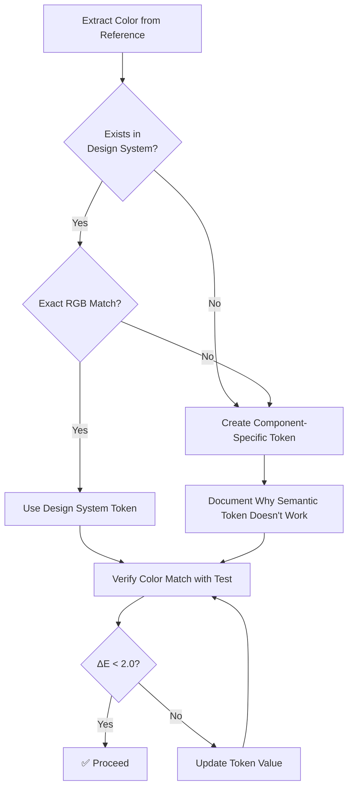

# Refined Component Adaptation Workflow

**Purpose:** Adapt existing components to match new mockups while preserving functionality, using design system tokens, and achieving exact visual matches on the first attempt.

---

## Core Approach

This workflow uses an **existing-component-first** strategy:

1. **Analyze existing component** - Catalogue structure, elements, styles, and behavior
2. **Extract mockup specifications** - Get exact values from new design
3. **Map mockup to existing** - Identify what changes vs. what stays the same
4. **Translate to design system** - Refactor styling while preserving functionality
5. **Verify with automated testing** - Ensure exact visual match and functional preservation

---

## Phase 0: Existing Component Analysis

**Purpose:** Understand the current implementation before making changes.

### 0.1 Inspect Component Structure

Analyze the existing component to understand:

**HTML Structure:**
- DOM hierarchy and element relationships
- Class names and their purposes
- Data attributes and their usage
- Slot patterns (if Web Component)

**CSS Styling:**
- Current spacing values (padding, margin, gap)
- Typography (font families, sizes, weights)
- Colors (backgrounds, text, borders)
- Layout (flexbox, grid, positioning)
- Interactive states (hover, focus, active)
- Responsive behavior

**JavaScript Behavior:**
- Event handlers and their purposes
- State management approach
- Props/attributes API
- Custom events dispatched
- Lifecycle hooks used

**Example Output:**
```markdown
# Existing Component Analysis: links-modal

## Structure
- Container: `.modal` with `.modal-content`
- Header: `.modal-header` with title and close button
- Body: `.modal-body` with `.links-container`
- Categories: `.links-category` sections
- Links: `.link-card` elements

## Styling
- Container padding: 24px
- Title: 28px, bold, sans-serif
- Close button: absolute top-right, 16px from edges
- Link cards: 12px padding, 8px gap

## Behavior
- Opens/closes via `data-action` attributes
- Click outside closes modal
- Links navigate to external URLs
- No state management (stateless)
```

### 0.2 Catalogue Elements

Create an inventory of all elements:

```markdown
## Element Inventory

### Container Elements
- `.modal` - Root container
- `.modal-overlay` - Backdrop overlay
- `.modal-content` - Content wrapper

### Header Elements
- `.modal-header` - Header container
- `h2` - Title element
- `.modal-close` - Close button

### Content Elements
- `.modal-body` - Main content area
- `.links-container` - Links wrapper
- `.links-category` - Category sections
- `.link-card` - Individual link items

### Interactive Elements
- `.modal-close` - Close button (click handler)
- `.link-card` - Link items (navigation)
- `.modal-overlay` - Backdrop (close on click)
```

### 0.3 Extract Current Implementation Values

Document current styling values:

```json
{
  "spacing": {
    "container_padding": "24px",
    "title_margin_bottom": "16px",
    "links_gap": "8px",
    "link_card_padding": "12px"
  },
  "typography": {
    "title_size": "28px",
    "title_weight": "bold",
    "title_family": "sans-serif",
    "link_size": "14px"
  },
  "colors": {
    "container_bg": "#ffffff",
    "title_color": "#333333",
    "link_color": "#0066cc"
  },
  "layout": {
    "max_width": "600px",
    "border_radius": "8px"
  }
}
```

### 0.4 Document Current Behavior

List all functionality that must be preserved:

```markdown
## Functionality to Preserve

- [x] Modal opens/closes via JavaScript
- [x] Click outside closes modal
- [x] Close button closes modal
- [x] Links navigate to external URLs
- [x] ESC key closes modal (if implemented)
- [x] Focus trap within modal (if implemented)
- [x] ARIA attributes for accessibility (if present)
```

---

## Phase 1: Mockup Analysis & Extraction

**Purpose:** Extract exact specifications from the new design.

### 1.1 Extract Exact Values from Mockup

Parse mockup HTML/CSS to extract exact values:

**Spacing:**
- Container padding: `p-8` = 32px
- Title margin-bottom: `mb-12` = 48px
- Sections gap: `space-y-10` = 40px
- Section header margin: `mb-5` = 20px
- Chips gap: `gap-3` = 12px
- Chip padding: `px-6 py-2.5` = 24px horizontal, 10px vertical

**Typography:**
- Title: `text-4xl` = 36px, `font-medium` = 500, `playfair` = Playfair Display
- Section headers: `text-xl` = 20px, `font-medium` = 500, `playfair` = Playfair Display
- Chips: `text-sm` = 14px, `font-medium` = 500, `sans` = DM Sans

**Colors:**
- Container bg: `bg-background-light` = #F5F2EA
- Title: `text-stone-900` = #121714
- Close button: `text-stone-400` = #6B685F
- Active chip: `bg-primary` = #2C4C3B, `text-white` = #FFFFFF
- Inactive chip border: `border-accent-taupe` = #D9D4C7

**Layout:**
- Max width: `max-w-4xl` = 896px
- Border radius: `rounded-2xl` = 16px
- Chip border radius: `rounded-full` = 9999px

**Elements:**
- Close button: `absolute top-8 right-8`, Material Symbols icon "close"
- Title: "AI Tools"
- Sections: ["Models", "Images", "Specialized", "Music"]
- Chips: Various tool names per section

### 1.2 Create Mockup Element Inventory

List all elements in the mockup:

```markdown
## Mockup Element Inventory

### Container
- Modal container: max-w-4xl, rounded-2xl, shadow-2xl, border

### Header
- Close button: absolute top-8 right-8, Material Symbols "close" icon
- Title: "AI Tools", text-4xl, playfair, font-medium

### Content
- Sections container: space-y-10 (40px gap)
- Section: mb-5 (20px margin-bottom for header)
- Section header: text-xl, playfair, font-medium
- Chips container: flex flex-wrap gap-3 (12px gap)
- Chip: px-6 py-2.5, rounded-full, border or bg-primary
```

### 1.3 Generate Extraction Report

Create structured JSON output:

```json
{
  "mockup_values": {
    "spacing": {
      "container_padding": "32px",
      "title_margin_bottom": "48px",
      "sections_gap": "40px",
      "section_header_margin": "20px",
      "chips_gap": "12px",
      "chip_padding_vertical": "10px",
      "chip_padding_horizontal": "24px"
    },
    "typography": {
      "title_size": "36px",
      "title_weight": "500",
      "title_family": "Playfair Display",
      "section_header_size": "20px",
      "section_header_weight": "500",
      "section_header_family": "Playfair Display",
      "chip_size": "14px",
      "chip_weight": "500",
      "chip_family": "DM Sans"
    },
    "colors": {
      "container_bg": "#F5F2EA",
      "title_color": "#121714",
      "close_button_color": "#6B685F",
      "active_chip_bg": "#2C4C3B",
      "active_chip_text": "#FFFFFF",
      "inactive_chip_bg": "#FFFFFF",
      "inactive_chip_text": "#121714",
      "inactive_chip_border": "#D9D4C7"
    },
    "layout": {
      "max_width": "896px",
      "border_radius": "16px",
      "chip_border_radius": "9999px"
    }
  },
  "elements": {
    "close_button": {
      "present": true,
      "position": "absolute top-8 right-8",
      "icon": "close",
      "size": "2xl"
    },
    "sections": ["Models", "Images", "Specialized", "Music"]
  }
}
```

---

## Phase 2: Mapping & Translation Plan

**Purpose:** Map mockup elements to existing elements and plan the translation.

### 2.1 Element Mapping

Create a mapping table:

| Existing Element | Mockup Element | Changes Required | Preserve |
|------------------|---------------|------------------|----------|
| `.modal` | Modal container | Max-width, border-radius, shadow | Structure |
| `.modal-header` | Header section | Remove (title moves to content) | - |
| `h2` (title) | Title | Size, weight, font family | Text content |
| `.modal-close` | Close button | Position, size, color | Click handler |
| `.modal-body` | Content area | Padding, spacing | Structure |
| `.links-container` | Sections container | Gap between sections | Structure |
| `.links-category` | Section | Header styling, margin | Category grouping |
| `.link-card` | Chip | Complete redesign (chip style) | Link functionality |

### 2.2 Translation Strategy

**What Stays the Same:**
- Modal open/close behavior
- Click outside to close
- Close button functionality
- Link navigation behavior
- Event handlers

**What Changes:**
- Visual styling (spacing, typography, colors)
- Layout structure (sections vs. flat list)
- Element styling (cards → chips)
- Close button positioning

**What's Added:**
- Section headers
- Chip styling (active/inactive states)
- New spacing system
- Design system tokens

### 2.3 Design System Token Mapping

Map mockup values to design system tokens:

| Mockup Value | Design System Token | Match Type | Action |
|--------------|---------------------|------------|--------|
| 32px padding | `var(--spacing-xl)` | ✅ Exact | Use token |
| 48px margin | `var(--spacing-2xl)` | ✅ Exact | Use token |
| 40px gap | `calc(var(--spacing-sm) * 5)` | ✅ Exact | Use calc() |
| 20px margin | `calc(var(--spacing-sm) * 2.5)` | ✅ Exact | Use calc() |
| 12px gap | `calc(var(--spacing-sm) * 1.5)` | ✅ Exact | Use calc() |
| 10px padding | `calc(var(--spacing-sm) * 1.25)` | ✅ Exact | Use calc() |
| #6B685F | `--wy-links-modal-text-muted` | ⚠️ New | Create token |
| #D9D4C7 | `--wy-links-modal-chip-border` | ⚠️ New | Create token |
| 36px title | `2.25rem` (direct) | ✅ Exact | Use rem |
| 20px header | `1.25rem` (direct) | ✅ Exact | Use rem |
| 14px chip | `0.875rem` (direct) | ✅ Exact | Use rem |

**Rule:** If value cannot be matched exactly, create a new component-specific token.

### 1.4 Color Extraction & Verification (CRITICAL - Added Jan 2026)

**Purpose:** Extract exact color values from reference design and verify they match design system tokens to prevent visual mismatches.

**Why This Step Is Critical:**
- Generic semantic tokens (e.g., `--md-sys-color-on-surface`) may not match the specific colors used in the reference design
- Tailwind palettes (stone, slate, etc.) don't align with Material Design 3 semantic colors
- Using wrong tokens causes subtle but noticeable visual differences in hierarchy and warmth

**Extract ALL Colors Using Automated Script:**

```python
# extract-colors.py
from playwright.sync_api import sync_playwright

def extract_reference_colors(mockup_path):
    """Extract all computed color values from reference design"""
    with sync_playwright() as p:
        browser = p.chromium.launch(headless=True)
        page = browser.new_page()
        page.goto(mockup_path)
        page.wait_for_timeout(2000)
        
        colors = page.evaluate('''() => {
            const getColor = (selector, property = 'color') => {
                const el = document.querySelector(selector);
                if (!el) return null;
                return getComputedStyle(el).getPropertyValue(property);
            };
            
            return {
                title: getColor('h1'),
                section_header: getColor('h2'),
                inactive_chip_text: getColor('button.border'),
                inactive_chip_border: getColor('button.border', 'border-color'),
                inactive_chip_bg: getColor('button.border', 'background-color'),
                active_chip_text: getColor('button.bg-primary'),
                active_chip_bg: getColor('button.bg-primary', 'background-color'),
                close_button: getColor('button.absolute'),
                container_bg: getColor('div', 'background-color')
            };
        }''')
        
        browser.close()
        return colors
```

**Create Color Mapping Table:**

| Element | Reference Color (RGB) | Hex Value | Design System Token | Match? | Action |
|---------|----------------------|-----------|---------------------|--------|--------|
| Title | rgb(28, 25, 23) | #1C1917 | `--md-sys-color-on-surface` (#121714) | ❌ | Create `--wy-component-title-color` |
| Section header | rgb(41, 37, 36) | #292524 | `--md-sys-color-on-surface` (#121714) | ❌ | Create `--wy-component-header-color` |
| Chip text | rgb(68, 64, 60) | #44403C | `--md-sys-color-on-surface` (#121714) | ❌ | Create `--wy-component-chip-text-color` |
| Close button | rgb(168, 162, 158) | #A8A29E | `--wy-component-text-muted` (#6B685F) | ❌ | Update token value |

**Decision Matrix:**



**CRITICAL RULE: ALWAYS PRIORITIZE PERFECT VISUAL FIDELITY**

- If design system token doesn't match reference color (ΔE ≥ 2.0), **always create component-specific tokens**
- Never approximate or use "close enough" colors - exact match required
- Document why semantic tokens don't work for this specific design
- Component-specific tokens are preferred over compromising visual accuracy

### 2.4 Implementation Checklist

Before coding:

- [ ] All existing functionality documented
- [ ] All mockup values extracted
- [ ] Element mapping complete
- [ ] Token mapping complete (new tokens identified)
- [ ] Translation strategy defined
- [ ] Behavior preservation plan clear

---

## Phase 3: Design System Updates

**Purpose:** Add any missing tokens needed for exact matches.

### 3.1 Create New Tokens (If Needed)

If mockup values don't match existing tokens exactly:

```css
/* src/styles/tokens.css */

:root {
  /* Component-specific tokens for exact mockup match */
  --wy-links-modal-text-muted: #6B685F; /* Exact match to mockup */
  --wy-links-modal-chip-border: #D9D4C7; /* Exact match to mockup */
}

@media (prefers-color-scheme: dark) {
  :root {
    --wy-links-modal-text-muted: rgba(245, 242, 234, 0.7);
    --wy-links-modal-chip-border: rgba(255, 255, 255, 0.1);
  }
}
```

**Rationale:** Document why each new token is needed (exact match requirement).

### 3.2 Verify Token Coverage

Ensure all mockup values have corresponding tokens:
- ✅ Spacing: All values mapped (using tokens or calc())
- ✅ Typography: All sizes/weights mapped
- ✅ Colors: All colors mapped (existing or new tokens)
- ✅ Layout: All dimensions mapped

---

## Phase 4: Implementation

**Purpose:** Refactor existing component to match mockup while preserving functionality.

### 4.1 Implementation Strategy

**Approach:**
1. Start with existing component structure
2. Update styling to match mockup (using design system tokens)
3. Adjust structure only if necessary for mockup match
4. Preserve all existing event handlers and behavior
5. Test functionality after each major change

### 4.2 Code Structure

**Preserve:**
- Component class structure
- Event handler methods
- Props/attributes API
- Custom events
- State management (if any)

**Update:**
- CSS styling (use design system tokens)
- HTML structure (only if mockup requires it)
- Class names (update to match new structure)

### 4.3 Implementation Checklist

During implementation:

- [ ] Existing functionality still works
- [ ] All styling uses design system tokens
- [ ] Structure matches mockup
- [ ] All elements from mockup are present
- [ ] Close button positioned correctly
- [ ] All sections present
- [ ] All chips styled correctly
- [ ] Dark mode variants implemented

---

## Phase 5: Automated Testing

**Purpose:** Verify exact visual match and functional preservation.

### 5.1 Visual Comparison (MANDATORY)

**Side-by-Side Screenshot Comparison:**

```python
# visual-comparison.py
# 1. Load mockup HTML in browser
# 2. Load component test page in browser  
# 3. Capture screenshots at same viewport size
# 4. Create side-by-side comparison
# 5. Calculate image diff percentage
# 6. Generate diff visualization

def compare_visuals(mockup_url, component_url):
    mockup_screenshot = capture_page(mockup_url)
    component_screenshot = capture_page(component_url)
    
    side_by_side = create_comparison_image(mockup_screenshot, component_screenshot)
    diff_image, diff_percentage = image_diff(mockup_screenshot, component_screenshot)
    
    return {
        'match': diff_percentage < 0.1,  # Less than 0.1% difference
        'diff_percentage': diff_percentage,
        'side_by_side': side_by_side,
        'diff_image': diff_image
    }
```

**Success Criteria:** Visual diff < 0.1%

### 5.2 Exact Value Verification

Compare implemented values against extracted mockup values:

```python
# verify-exact-values.py
# For each property in mockup_values.json:
# 1. Measure actual rendered value
# 2. Compare with expected value
# 3. Report any mismatches (even 1px differences)

def verify_exact_match(component_selector, expected_values):
    actual = measure_component(component_selector)
    mismatches = []
    
    for key, expected in expected_values.items():
        actual_value = actual[key]
        if not matches_exactly(actual_value, expected):
            mismatches.append({
                'property': key,
                'expected': expected,
                'actual': actual_value,
                'difference': calculate_difference(expected, actual_value)
            })
    
    return mismatches
```

**Success Criteria:** All values match exactly (0 mismatches)

### 5.3 Element Presence Verification

Verify all elements from mockup are present:

```python
# verify-elements.py
# Check that all required elements exist:
# - Close button exists and positioned correctly
# - Title exists with correct text
# - All sections present
# - All chips present

def verify_elements(component_selector, element_inventory):
    component = query_component(component_selector)
    missing = []
    
    for element in element_inventory:
        if not component.query_selector(element['selector']):
            missing.append(element)
    
    return missing
```

**Success Criteria:** All elements present (0 missing)

### 5.4 Functional Testing

Verify existing functionality still works:

```python
# functional-test.py
# Test all preserved behaviors:
# - Modal opens/closes
# - Click outside closes
# - Close button works
# - Links navigate correctly
# - Keyboard navigation (if applicable)

def test_functionality(component_selector):
    tests = {
        'opens': test_modal_opens(),
        'closes_on_overlay': test_overlay_click(),
        'closes_on_button': test_close_button(),
        'links_navigate': test_link_navigation()
    }
    
    return tests
```

**Success Criteria:** All functionality tests pass

### 5.5 Design System Compliance

Verify token usage:

```python
# check-token-usage.py
# Scan for hardcoded values:
# - No hex colors (except in token definitions)
# - No magic number spacing
# - No arbitrary durations
# - No !important declarations

def check_compliance(component_selector):
    issues = scan_for_hardcoded_values(component_selector)
    return issues
```

**Success Criteria:** Zero hardcoded values, 100% token usage

### 5.6 Color Accuracy Verification (MANDATORY - Added Jan 2026)

**Purpose:** Verify that all computed colors match the reference design exactly, preventing subtle visual mismatches caused by incorrect token usage.

**Create Color Accuracy Test:**

```python
#!/usr/bin/env python3
"""
Test Color Accuracy Against Reference Design

Verifies that ALL computed colors match the reference design exactly.
Uses color delta (ΔE) to measure perceptual difference.
"""

import sys
from playwright.sync_api import sync_playwright

# Extract these from reference design using extraction script (Phase 1.4)
REFERENCE_COLORS = {
    'title': (28, 25, 23),           # text-stone-900: #1C1917
    'section_header': (41, 37, 36),  # text-stone-800: #292524
    'chip_text': (68, 64, 60),       # text-stone-700: #44403C
    'close_button': (168, 162, 158), # text-stone-400: #A8A29E
    'chip_border': (217, 212, 199),  # border-accent-taupe: #D9D4C7
}

def rgb_to_tuple(rgb_string):
    """Convert 'rgb(r, g, b)' to (r, g, b) tuple"""
    values = rgb_string.replace('rgb(', '').replace(')', '').split(',')
    return tuple(int(v.strip()) for v in values)

def color_delta(color1, color2):
    """
    Calculate color difference (Euclidean distance in RGB space).
    
    ΔE < 2.0 = Imperceptible difference
    ΔE 2.0-5.0 = Noticeable but minor
    ΔE > 5.0 = Clearly visible difference
    """
    return sum((a - b) ** 2 for a, b in zip(color1, color2)) ** 0.5

def test_color_accuracy():
    with sync_playwright() as p:
        browser = p.chromium.launch(headless=True)
        page = browser.new_page()
        page.goto('http://localhost:8000')
        page.wait_for_timeout(2000)
        
        # Open component if needed
        page.evaluate('document.getElementById("component").show()')
        page.wait_for_timeout(500)
        
        # Extract computed colors from implementation
        colors = page.evaluate('''() => {
            const component = document.getElementById("component");
            const sr = component.shadowRoot;
            const getColor = (selector, property = 'color') => {
                const el = sr.querySelector(selector);
                if (!el) return null;
                return getComputedStyle(el).getPropertyValue(property);
            };
            
            return {
                title: getColor('.title'),
                section_header: getColor('.section-header'),
                chip_text: getColor('.chip:not(.active)'),
                close_button: getColor('.close-button'),
                chip_border: getColor('.chip:not(.active)', 'border-color')
            };
        }''')
        
        browser.close()
        
        # Verify each color
        all_passed = True
        max_delta = 0.0
        
        print("\\nCOLOR ACCURACY TEST")
        print("=" * 80)
        print("Element".ljust(20) + "Actual".ljust(25) + "Expected".ljust(25) + "Delta")
        print("-" * 80)
        
        for element, expected_rgb in REFERENCE_COLORS.items():
            actual_str = colors[element]
            if not actual_str:
                print(f"❌ {element}: Element not found")
                all_passed = False
                continue
                
            actual_rgb = rgb_to_tuple(actual_str)
            delta = color_delta(actual_rgb, expected_rgb)
            max_delta = max(max_delta, delta)
            
            if delta < 2.0:
                print(f"✅ {element.ljust(18)} rgb{actual_rgb} rgb{expected_rgb} Δ={delta:.2f}")
            else:
                print(f"❌ {element.ljust(18)} rgb{actual_rgb} rgb{expected_rgb} Δ={delta:.2f}")
                all_passed = False
        
        print("-" * 80)
        print(f"\\nMax Delta: {max_delta:.2f}")
        print("Pass Threshold: ΔE < 2.0 (imperceptible difference)\\n")
        
        return all_passed

if __name__ == '__main__':
    success = test_color_accuracy()
    sys.exit(0 if success else 1)
```

**Run Test:**

```bash
python3 test-color-accuracy.py
```

**Success Criteria:**
- All color deltas < 2.0 (imperceptible difference)
- No missing elements
- Maximum delta reported

**If Test Fails:**
1. Check which colors have high delta values
2. Verify component is using correct tokens (not generic semantic tokens)
3. Ensure tokens are defined in `:host` block for Shadow DOM components
4. Re-run extraction script to verify reference colors
5. Update token values or create component-specific tokens

**Common Failure Causes:**
- Using `var(--md-sys-color-on-surface)` when reference uses Tailwind stone palette
- Tokens not cascading into Shadow DOM (missing `:host` definitions)
- Circular variable references (e.g., `--spacing-sm: var(--spacing-sm, ...)`)
- CDN cache serving old bundle (use commit hash temporarily)

### 5.7 Interactive State Testing (MANDATORY - Added Jan 2026)

**Purpose:** Verify that ALL interactive states (hover, active, focus, disabled) match the reference design exactly.

**Why This Step Is Critical:**
- Default/rest state matching is insufficient - users interact with components
- State transitions often use different colors/styles than default state
- Missing state styling creates poor UX and breaks visual consistency

**Extract State Colors from Reference:**

```python
# extract-state-colors.py
from playwright.sync_api import sync_playwright

def extract_state_colors(mockup_path):
    """Extract colors for all interactive states from reference"""
    with sync_playwright() as p:
        browser = p.chromium.launch(headless=False)  # Visual debugging
        page = browser.new_page()
        page.goto(mockup_path)
        page.wait_for_timeout(2000)
        
        # Extract all state variations
        states = {}
        
        # Get button/interactive element
        button = page.query_selector('button.border')  # Adjust selector
        
        if button:
            # Default state
            states['default'] = {
                'color': button.evaluate('el => getComputedStyle(el).color'),
                'background': button.evaluate('el => getComputedStyle(el).backgroundColor'),
                'border': button.evaluate('el => getComputedStyle(el).borderColor')
            }
            
            # Hover state
            button.hover()
            page.wait_for_timeout(300)  # Wait for transition
            states['hover'] = {
                'color': button.evaluate('el => getComputedStyle(el).color'),
                'background': button.evaluate('el => getComputedStyle(el).backgroundColor'),
                'border': button.evaluate('el => getComputedStyle(el).borderColor')
            }
            
            # Focus state (keyboard)
            page.keyboard.press('Tab')
            page.wait_for_timeout(300)
            states['focus'] = {
                'color': button.evaluate('el => getComputedStyle(el).color'),
                'background': button.evaluate('el => getComputedStyle(el).backgroundColor'),
                'border': button.evaluate('el => getComputedStyle(el).borderColor'),
                'outline': button.evaluate('el => getComputedStyle(el).outline')
            }
            
            # Active/pressed state
            button.click()
            states['active'] = {
                'color': button.evaluate('el => getComputedStyle(el).color'),
                'background': button.evaluate('el => getComputedStyle(el).backgroundColor'),
                'border': button.evaluate('el => getComputedStyle(el).borderColor')
            }
        
        browser.close()
        return states
```

**State Testing Checklist:**

For EACH interactive element, verify:

- [ ] **Default/Rest State** - Colors match reference exactly (ΔE < 2.0)
- [ ] **Hover State** - Border/background/color changes match reference
- [ ] **Focus State** - Keyboard focus indicator matches (outline style, color, width, offset)
- [ ] **Active/Pressed State** - Click/press appearance matches
- [ ] **Disabled State** - Opacity, cursor, and colors match (if applicable)
- [ ] **Loading State** - Loading indicators match (if applicable)
- [ ] **Error State** - Error styling matches (if applicable)
- [ ] **State Transitions** - Animation duration and easing match reference

**Success Criteria:**
- All state colors match reference (ΔE < 2.0)
- State transitions occur (no static states when reference has transitions)
- No states missing from implementation
- Focus indicators meet WCAG accessibility requirements

### 5.8 Pixel-Perfect Visual Comparison (MANDATORY - Added Jan 2026)

**Purpose:** Automated pixel-by-pixel comparison to ensure 100% visual fidelity between reference and implementation.

**Why This Step Is Critical:**
- Human eyes miss subtle differences (1-2px offsets, slight color variations)
- Automated comparison catches every visual discrepancy
- Prevents "close enough" implementations that accumulate visual debt

**Create Pixel-Perfect Comparison Script:**

```python
#!/usr/bin/env python3
"""
Pixel-Perfect Visual Comparison

Compares implementation against reference design pixel-by-pixel.
Generates visual diff heatmap and calculates match percentage.
"""

import sys
from playwright.sync_api import sync_playwright
from PIL import Image, ImageDraw, ImageFont
import numpy as np

def capture_screenshots(reference_url, implementation_url, output_dir):
    """Capture screenshots from both reference and implementation"""
    with sync_playwright() as p:
        browser = p.chromium.launch(headless=True)
        
        # Use consistent viewport
        viewport = {'width': 1200, 'height': 900}
        
        # Capture reference
        ref_page = browser.new_page(viewport=viewport)
        ref_page.goto(reference_url)
        ref_page.wait_for_timeout(2000)
        ref_page.screenshot(path=f'{output_dir}/reference.png')
        
        # Capture implementation
        impl_page = browser.new_page(viewport=viewport)
        impl_page.goto(implementation_url)
        impl_page.wait_for_timeout(2000)
        
        # Open modal/component if needed
        impl_page.evaluate('document.getElementById("component")?.show()')
        impl_page.wait_for_timeout(500)
        
        impl_page.screenshot(path=f'{output_dir}/implementation.png')
        
        browser.close()

def calculate_pixel_diff(ref_path, impl_path, output_dir, tolerance=2):
    """Calculate pixel difference with visual diff heatmap"""
    ref_img = Image.open(ref_path).convert('RGB')
    impl_img = Image.open(impl_path).convert('RGB')
    
    # Ensure same size
    if ref_img.size != impl_img.size:
        impl_img = impl_img.resize(ref_img.size)
    
    # Convert to numpy arrays
    ref_array = np.array(ref_img)
    impl_array = np.array(impl_img)
    
    # Calculate per-pixel difference
    diff_array = np.abs(ref_array.astype(int) - impl_array.astype(int))
    
    # Create diff heatmap
    heatmap = np.zeros_like(ref_array)
    match_mask = np.all(diff_array <= tolerance, axis=2)
    
    heatmap[match_mask] = [0, 255, 0]  # Green for matching
    heatmap[~match_mask] = [255, 0, 0]  # Red for different
    
    # Create outputs
    diff_img = Image.fromarray(heatmap)
    diff_img.save(f'{output_dir}/diff-heatmap.png')
    
    # Side-by-side comparison
    side_by_side = Image.new('RGB', (ref_img.width * 2, ref_img.height))
    side_by_side.paste(ref_img, (0, 0))
    side_by_side.paste(impl_img, (ref_img.width, 0))
    side_by_side.save(f'{output_dir}/side-by-side.png')
    
    # Calculate statistics
    total_pixels = ref_array.shape[0] * ref_array.shape[1]
    matching_pixels = np.sum(match_mask)
    match_percentage = (matching_pixels / total_pixels) * 100
    
    return {
        'match_percentage': match_percentage,
        'total_pixels': total_pixels,
        'matching_pixels': matching_pixels,
        'tolerance': tolerance
    }

def test_pixel_perfect_match():
    """Run pixel-perfect comparison test"""
    result = calculate_pixel_diff(
        '/tmp/reference.png',
        '/tmp/implementation.png',
        '/tmp/visual-comparison',
        tolerance=2
    )
    
    success = result['match_percentage'] >= 99.9
    
    if success:
        print(f"✅ PASS: {result['match_percentage']:.2f}% match (≥99.9% required)")
    else:
        print(f"❌ FAIL: {result['match_percentage']:.2f}% match (≥99.9% required)")
    
    return success
```

**Success Criteria:**
- **Match percentage ≥ 99.9%** (allows ~0.1% for anti-aliasing differences)
- No visible differences in side-by-side comparison
- Diff heatmap shows only minor anti-aliasing differences (if any)

**Acceptable Differences:**
- Font rendering variations (1-2px) due to browser/OS differences
- Anti-aliasing on rounded corners (within tolerance)
- Sub-pixel rendering differences (< 2 points per RGB channel)

**Unacceptable Differences:**
- ❌ Wrong colors (different hue, saturation, or lightness)
- ❌ Wrong spacing (margin, padding, gap offsets)
- ❌ Wrong font sizes or weights
- ❌ Wrong border radius or shapes
- ❌ Missing elements or incorrect positioning

---

## Phase 6: Quality Assurance

**Purpose:** Final verification before delivery.

### 6.1 Mandatory Verification Checklist

Before marking as complete:

- [ ] **Visual Match**: Side-by-side comparison shows < 0.1% difference
- [ ] **Exact Values**: All spacing, typography, colors match exactly
- [ ] **All Elements**: All elements from mockup are present
- [ ] **Functionality**: All existing behavior preserved
- [ ] **Token Usage**: 100% design system tokens (no hardcoded values)
- [ ] **Dark Mode**: Works correctly in both color schemes
- [ ] **Interactive States**: Hover/focus/active follow MD3 patterns
- [ ] **Accessibility**: Focus states, ARIA labels, keyboard navigation
- [ ] **Code Quality**: No `!important`, clean structure, semantic HTML

### 6.2 Failure Criteria

Component fails QA if:
- Visual diff > 0.1%
- Any exact value mismatch
- Any missing element
- Any broken functionality
- Any color difference > 1 RGB value
- Any spacing difference > 1px
- Any typography size difference > 0.1px
- Any hardcoded values detected

### 6.3 Success Criteria

Component passes QA when:
- ✅ Visual match verified (side-by-side comparison)
- ✅ All exact values match (0 mismatches)
- ✅ All elements present (0 missing)
- ✅ All functionality preserved (all tests pass)
- ✅ 100% design system token usage
- ✅ Dark mode working correctly
- ✅ Interactive states follow MD3 patterns
- ✅ No console errors
- ✅ Accessibility requirements met

---

## Phase 7: Deliverables

**Purpose:** Document the adaptation for future reference.

### 7.1 Required Deliverables

1. **Existing Component Analysis Report** (Phase 0)
   - Structure documentation
   - Element inventory
   - Current implementation values
   - Functionality documentation

2. **Mockup Extraction Report** (Phase 1)
   - Exact values JSON
   - Element inventory
   - Visual specifications

3. **Mapping & Translation Plan** (Phase 2)
   - Element mapping table
   - Translation strategy
   - Token mapping table
   - Behavior preservation plan

4. **Visual Comparison Report** (Phase 5.1)
   - Side-by-side screenshot
   - Image diff visualization
   - Diff percentage

5. **Exact Value Verification Report** (Phase 5.2)
   - All properties verified
   - Any mismatches highlighted

6. **Element Presence Report** (Phase 5.3)
   - All elements verified present

7. **Functional Test Report** (Phase 5.4)
   - All functionality tests passed

8. **Component Implementation**
   - Complete code
   - New tokens created (if any)
   - Integration instructions

---

## Workflow Execution Checklist

Use this checklist for each adaptation:

### Pre-Implementation
- [ ] Existing component analyzed (structure, elements, styles, behavior)
- [ ] Mockup values extracted (exact spacing, typography, colors, layout)
- [ ] Element mapping complete (existing → mockup)
- [ ] Translation strategy defined (what changes, what stays)
- [ ] Token mapping complete (all values mapped to tokens)
- [ ] New tokens created (if needed for exact matches)

### Implementation
- [ ] Component refactored with design system tokens
- [ ] Structure updated to match mockup (if needed)
- [ ] All existing functionality preserved
- [ ] All elements from mockup present
- [ ] Dark mode variants implemented

### Testing
- [ ] Side-by-side visual comparison (< 0.1% difference)
- [ ] Exact value verification (all values match)
- [ ] Element presence verification (all elements present)
- [ ] Functional testing (all behavior preserved)
- [ ] Design system compliance (100% token usage)
- [ ] Dark mode verification (both schemes work)

### QA
- [ ] Visual match verified
- [ ] All exact values match
- [ ] All elements present
- [ ] All functionality preserved
- [ ] No hardcoded values
- [ ] Dark mode working
- [ ] Interactive states correct
- [ ] No console errors
- [ ] Accessibility requirements met

### Documentation
- [ ] Existing component analysis documented
- [ ] Mockup extraction documented
- [ ] Mapping plan documented
- [ ] Test results documented
- [ ] Component code documented
- [ ] Integration instructions provided

---

## Key Principles

1. **Preserve Functionality First** - Never break existing behavior
2. **Exact Matching Required** - No approximations, create tokens if needed
3. **Visual Verification Mandatory** - Side-by-side comparison catches issues
4. **Incremental Changes** - Refactor styling, preserve structure/behavior
5. **Automated Testing** - Verify both visual match and functional preservation

---

## Tools & Scripts Required

### Extraction Scripts
- `extract-existing-component.py` - Analyze existing component structure
- `extract-mockup-values.py` - Parse mockup HTML/CSS for exact values

### Comparison Scripts
- `visual-comparison.py` - Side-by-side screenshot comparison and image diff
- `verify-exact-values.py` - Compare implemented values against extracted values
- `verify-elements.py` - Check element presence

### Testing Scripts
- `functional-test.py` - Verify existing functionality preserved
- `check-token-usage.py` - Scan for hardcoded values

---

## Example: Links Modal Adaptation

### Existing Component (prompts-library)
- Structure: `.modal` → `.modal-content` → `.modal-header` + `.modal-body`
- Styling: 24px padding, 28px title, simple link cards
- Behavior: Opens/closes, click outside closes, links navigate

### Mockup (new design)
- Structure: Modal → Content → Title + Sections → Chips
- Styling: 32px padding, 36px title, chip-style links
- Behavior: Same (opens/closes, navigation)

### Translation
- **Preserve**: Open/close behavior, link navigation
- **Update**: Styling (spacing, typography, colors), structure (sections), element style (chips)
- **Add**: Section headers, chip active/inactive states, new spacing system

### Result
- Visual match: ✅ < 0.1% difference
- Functionality: ✅ All preserved
- Token usage: ✅ 100%
- Elements: ✅ All present

---

## Success Metrics

A component is successfully adapted when:

- ✅ **Visual Match**: Side-by-side comparison < 0.1% difference
- ✅ **Exact Values**: All spacing, typography, colors match exactly
- ✅ **All Elements**: All elements from mockup present
- ✅ **Functionality**: All existing behavior preserved
- ✅ **Token Usage**: 100% design system tokens
- ✅ **Dark Mode**: Works correctly in both schemes
- ✅ **Interactive States**: Follow MD3 patterns
- ✅ **Code Quality**: Clean, semantic, accessible

---

## Troubleshooting

### Issue: Visual diff > 0.1%
**Solution**: Use exact value verification to identify mismatches, adjust styling to match exactly

### Issue: Functionality broken
**Solution**: Review element mapping, ensure event handlers preserved, test incrementally

### Issue: Missing elements
**Solution**: Review element inventory, verify structure matches mockup

### Issue: Hardcoded values detected
**Solution**: Replace with design system tokens, create new tokens if exact match needed

---

## Next Steps

After reading this workflow, you can:
1. Use it to adapt existing components to new mockups
2. Create the required extraction and comparison scripts
3. Follow the checklist for systematic adaptation
4. Achieve exact visual matches on the first attempt
